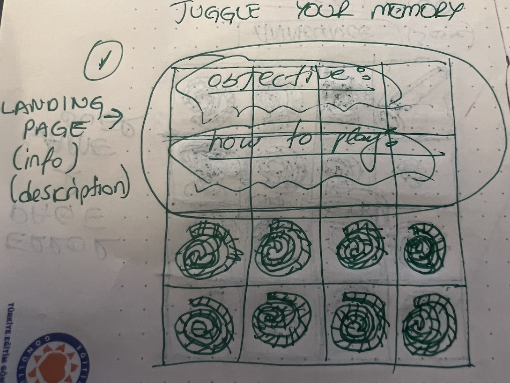
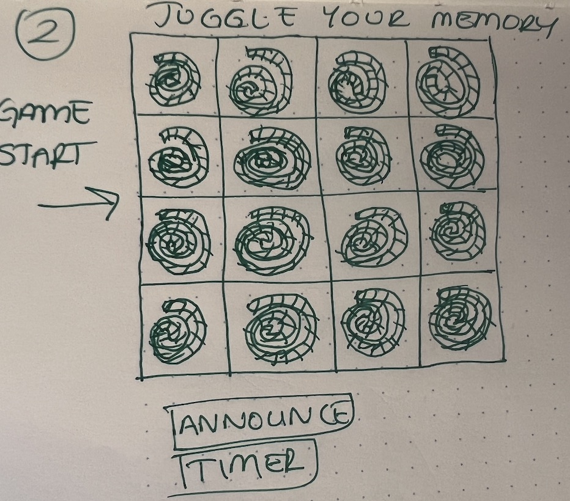
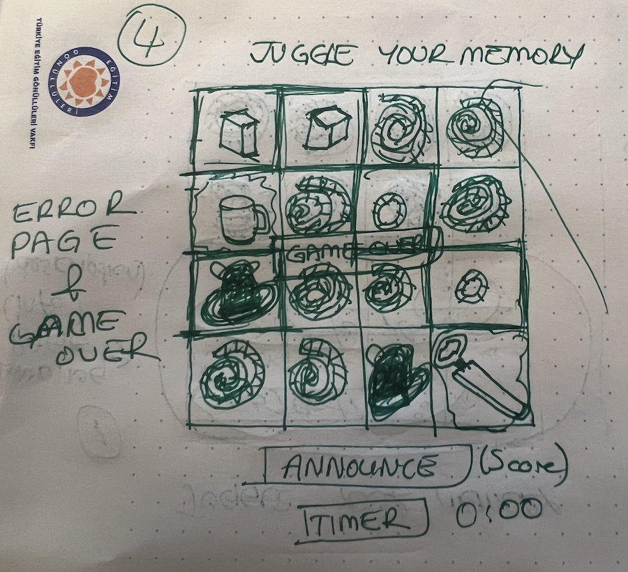

**Pitch:**

- Juggle your Memory

    * Test your memorizing skills with flipping cards & matching most of them in a deck of cards.

**WireFrames:**

* We will create a 4x4 grid game board layout with Javascript.
* Landing page.
* Game start page.
* Game ongoing page.
* Game over page.
* CSS styling will be used.
* JS DOM for funtionality.

**Instructions:**

* Click on each card and follow until find the matching pair.

**MVP:**

* Build a 4x4 board for cards.
* Build matching pairs of cards face down.
* Have a landing page with objectives and start game button.
* DOM funtionality will run.
* Select a random image for each pairs of cards. 
* Classes will be assigned to cards. 
* Event Listeners will be added according to the classes of card elements. 
* When a card clicked, cards will be flipped & expose image.
* Game Logic will be added.
    - When cards are not pairs (false), will flip back. 
    - Cards matched (true) fade away.
* Build a score table. 
* Update score table when cards matched.
* Announce if matched or not.
* Game over button function will reset the game.
    - clear the score table.
    - flip the cards back.

**Strech Goals**

* Build countdown timer to 1 min.
* Announce amount of matched pairs at given time.
* Shuffle cards each game.
* Adding animation to fading away of cards. 
* Adding sound to matched pairs.

