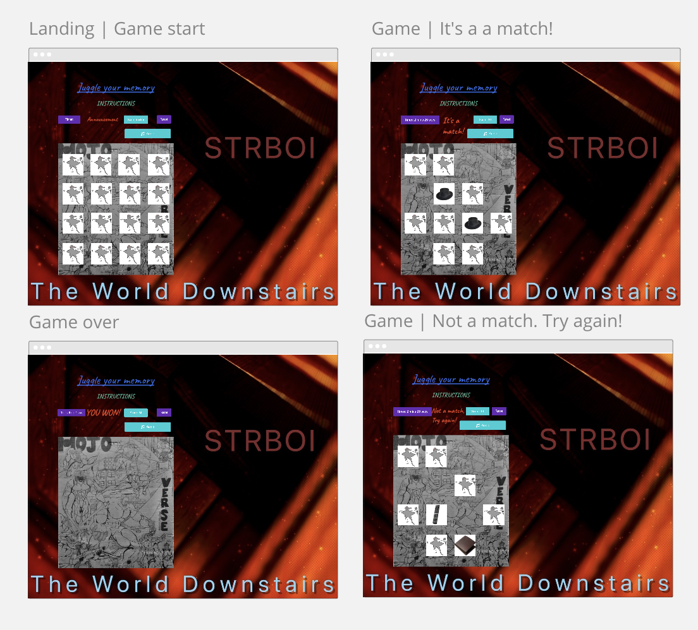

**Juggle your Memory**
 * Test your memorizing skills with flipping cards & matching most of them in a deck of cards.

**Instructions:**
* Click on each card and follow until find the matching pair.

**WireFrames:**
* We will create a 4x4 grid game board layout with landing, game active and game over layout.

**Tech Stack:**
* CSS
* JS 
* HTML

**MVP**
* Build a 4x4 board for cards.
* Build matching pairs of cards face down.
* Have a landing page with objectives.
* DOM funtionality will run.
* Select a random image for each pairs of cards. 
* Classes will be assigned to cards. 
* Event Listeners will be added according to the classes of card elements. 
* When a card clicked, cards will be flipped & expose image.
* Game Logic will be added.
    - When cards are not pairs (false), will flip back. 
    - Cards matched (true) fade away.
* Build a score table. 
* Update score table when cards matched.
* Announce if matched or not.
* Game over button function will reset the game.
    - clear the score table.
    - flip the cards back.

**Strech Goals Achieved & roadblocks worked through**   
* Built a timer.
* Shuffling cards each game. 
* Audio functionality added with pause and mute feautures.
* css styling to make it look neat.
* reset function work on displaying text. 
* debugging on pairs get matched at first flip. 
* animation and fading away of matched cards syncronized.  
* refactoring done.

**Strech Goals**
* Announce amount of matched pairs at given time.
* Adding animation to fading away of cards. 
* Adding sound to matched pairs.
* Make it responsive.
